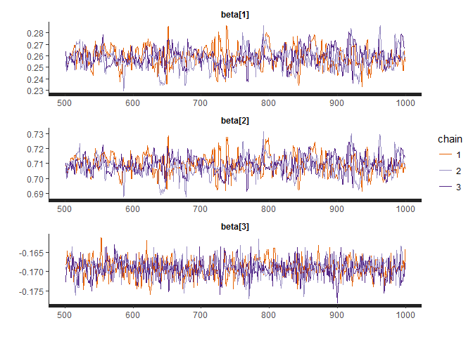
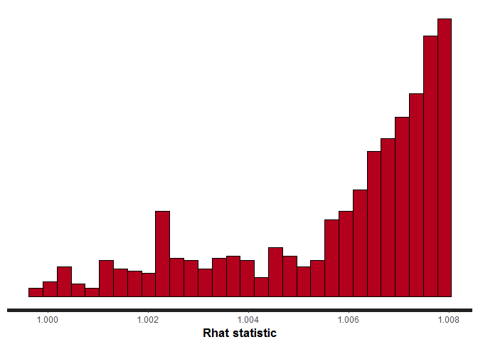
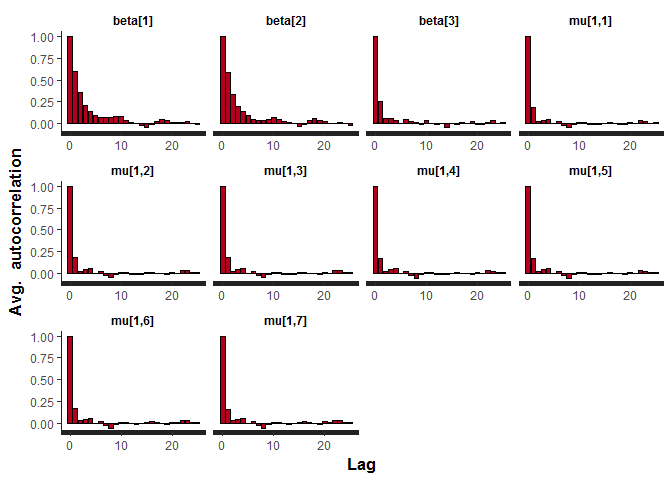
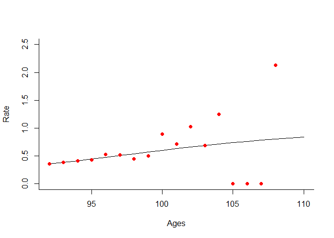
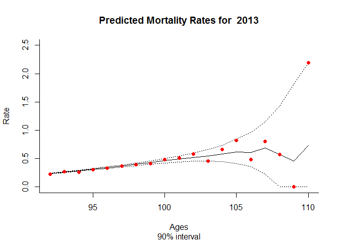

# Bayesian Statistics Short Course - Stan Workshop
Jason Hilton  
1st December 2016  


# Introduction
This workshop aims to demonstrate the basics of the Stan modelling language.


# Setup
### Getting the files
The first step is to download the files associated with this workshop.
Go to the github [page](github.com/jasonhilton/ons_stan) associated with this course. Click the green "Clone or download" button in the top right, and select "download zip". You will be given an option to save or open the files. Select open, and then when the file has finished downloading, select 'Extract all files' option.
Browse to your `conf**\mydocuments` folder (** being your user-number you got when you logged on), and extract the files here to an `ons_stan` folder. You may need to create this folder.

### Opening R and installing rstan
We will be working in R exclusively and using the R interface to stan.
The next step we need to install the `rstan` package for R and check that it is working.

In order for `rstan` to work with the machines you are using, you *must make sure you are using a version of R with version number higher than 3.3*, e.g. 3.3.1 . To run R, go to the start menu and open the statistics folder. We want to run "R x64 3.3.1". There may well be other versions available, but run this one.

This will bring up the Rgui and the console. Code is run by typing or pasting into the console.
In the console run the commands below. This will install the relevant R package, together with it's dependencies and load it so the functions we need are available. This may print some junk to the screen, and also bring up a few warning messages about packages being build in different versions of R, but this is generally nothing to worry about, so long as no messages labelled "error" are given.

```r
install.packages("rstan", repos = "http://cran.us.r-project.org"); library("rstan",)
```
If this doesn't work, try removing the `repos` argument `(", repos=http...")` and trying again, selecting the first CRAN mirror if prompted.


Generic instructions for installing stan  and rstan from scratch are available (here)[https://github.com/stan-dev/rstan/wiki/RStan-Getting-Started] (for rstan) and (here)[http://mc-stan.org/interfaces/] (for links to installation for other interfaces, e.g. python).

Note:- In general, rstan works well within RStudio. However, I have experienced some problems using rstan within RStudio on these machines specifically, so today we are better off using the standard R application.

### Setting working directory
We want R's working directory to be the one you unzipped earlier that contains the materials for this workshop. A sneaky way to achieve this is by running the following code, and when the dialogue box opens, *choose any file in the unzipped directory*. This will tell R the location of this file, and then the other lines use this information to set the working directory to the containing folder.


```r
path_to_file <- file.choose()
containing_dir <- dirname(path_to_file)
setwd(containing_dir)
```

### Further tips 
Remember you can look at the help file for any R function by typing `?` and then the function name at the R console.

# Fitting a Model for Old-Age Mortality
We will now fit a model to mortality at higher ages. We will start with a relatively simple model, where deaths are given a Poisson likelihood, and the linear predictor for logit-transformed mortality rates have age and time terms, together with an intercept. We give the parameters $\beta$ vague priors.


$$
\text{logit}(m_{x,t}) = \beta_0 + \beta_1 x + \beta_2 t \\
D_{x,t} \sim \text{Poisson}(m_{x,t}R_{x,t})\\
\beta \sim \text{Normal}(0,10) \\
$$
with $x$ referring to age, $t$ to time, $D_{x,t}$ to deaths of those at age $x$ at time $t$, and $R_{x,t}$ giving the relevant exposure (in person-years lived).


## Model Description in Stan
The stan file encoding this model is contained in the stan subfolder, but I have displayed it below.
Unfortunately, converting this to html seems to have removed some symbols from the model definition, so check back to the original file if you are unsure.


```stan
data {
  # here we declare what data we are passing in from outside stan (e.g. from R)
  int N; # ages
  int n_years; # years of data
  
  # matrix of deaths
  int<lower=0> deaths[N, n_years];
  
  # matrix of exposures
  matrix<lower=0>[N, n_years] expos;
  
  # we also pass in stardardised year and age variables.
  # we could also easily do this within stan.
  vector[N] age_standardised;
  vector[n_years] years_standardised;
}

parameters {
  # here we declare the parameter we wish to sample
  real beta[3];
}

model {
  # here we write the model
  
  # start with declarations of any local variables we use 
  # these are intermediaries we need to compute and aren't parameters or data.
  matrix[N, n_years] eta;
  matrix[N, n_years] mu;
  
  # priors -------------------------------------------------------------
  
  beta ~ normal(0, 10);
  
  # likelihood ---------------------------------------------------------
  
  # first construct the linear predictor
  # for each age
  for (i in 1:N){
    # for each year
    for (t in 1:n_years){
      eta[i,t] = (beta[1] + age_standardised[i] * beta[2] + 
                  years_standardised[t] * beta[3]);
    }
  }
  # We could use matrix multiplication rather than loops in the above,
  # with some adjustments to the data.
  # This would be quicker, but the looped version is clearer for first-time users.
  
  for (i in 1:N){
    for (t in 1:n_years){
      # ignore if there is no exposure. 
      if (expos[i,t] != 0){
        mu[i,t] = inv_logit(eta[i,t]);
        # add log_poisson density p(D | mu*R) to the log-posterior
        deaths[i,t] ~ poisson(mu[i,t] * expos[i,t]);
        
        # the (commented) statement below does almost exactly the same thing
        # target += poisson_lpdf(deaths[i,t] | mu[i,t] * expos[i,t])
        # target is the name of stan variable in which lp(theta | y) is accumulated.
      }
    }
  }
  
}

```


## Data
We first to load in the data to pass into stan. The data is saved in the data sub-directory of this folder as csv files so we can easily read it in. We have both male and female data, but we will start with male data.


```r
# list the files so we can see the file names
list.files("data")
```

```
## [1] "deaths_f_old.csv" "deaths_m_old.csv" "expos_f_old.csv" 
## [4] "expos_m_old.csv"
```

```r
# read in the ones we want
expos_m <- read.csv("data/expos_m_old.csv")
deaths_m <- read.csv("data/deaths_m_old.csv")
```

The `dim` command tells us the number of rows and columns in the data.
We can also look at the first few data points by index the data with square brackets: 

```r
dim(deaths_m)
```

```
## [1] 19 53
```

```r
deaths_m[1:10,1:10]
```

```
##       X1961   X1962 X1963 X1964 X1965 X1966 X1967 X1968 X1969 X1970
## 92  1061.61 1178.29  1228  1087  1257  1350  1293  1413  1431  1332
## 93   748.61  761.43   822   788   828   984   918  1025  1009  1035
## 94   503.00  538.69   564   523   583   634   677   785   728   793
## 95   322.85  351.01   378   344   379   438   414   538   473   542
## 96   240.39  234.14   242   234   266   293   280   340   336   354
## 97   128.66  131.04   124   141   165   160   180   214   201   207
## 98    57.67   71.70    84   102    90   124   104   110   134   149
## 99    38.44   40.11    52    58    46    57    61    68    70   105
## 100   39.39   24.37    25    20    37    24    43    37    52    44
## 101   16.26   14.25    15    14    19    17    17    29    26    24
```
The data is for years 1961-2013, and for ages 92-110

## Inputs
We will now use R to create the input data object upon which the stan model will run, using the data files we have loaded in.


```r
N <- dim(expos_m)[1]
n_years <- dim(expos_m)[2]

age  <- 1:N
years <- 1:n_years
# standardise age and years to aid convergence
age_standardised <- (age - mean(age)) / sd(age)
years_standardised <- (years -mean(years))/ sd(years)

# created a named list with all the elements mentioned in the stan model

stan_input_data <-list(N=N,
                       n_years=n_years,
                       age_standardised=age_standardised,
                       years_standardised=years_standardised,
                       expos=expos_m, 
             # note the name in the list (expos) is different from the variable name expos_m
             # The list name must match those declared in the stan model data section.
                       deaths=round(deaths_m))
```

The command `1:N` simply asks for the sequence of integers  $1, 2, \dots, N-1, N$.
Because we have declared deaths as integers we have to round them, or else stan will complain.


## Running Stan from R

We can run stan directly from R, using the stan commmand. Examine the help page for the command using `?stan`. 
We pass the location of the stan file containing the model (which is in the stan subfolder), together with the list of input data we have constructed. We also specify the number of independent chains and the number of iterations per chain.
You might see a lot of things printed to the console here. Don't worry, that's normal!


```r
stan_fit <- stan(file = "stan/old_age_1.stan", data = stan_input_data, iter = 1000,
                 chains=3, cores=3)
```

```
## In file included from c:/rpackages/BH/include/boost/multi_array/base.hpp:28:0,
##                  from c:/rpackages/BH/include/boost/multi_array.hpp:21,
##                  from c:/rpackages/BH/include/boost/numeric/odeint/util/multi_array_adaption.hpp:29,
##                  from c:/rpackages/BH/include/boost/numeric/odeint.hpp:61,
##                  from c:/rpackages/StanHeaders/include/stan/math/prim/arr/functor/integrate_ode_rk45.hpp:13,
##                  from c:/rpackages/StanHeaders/include/stan/math/prim/arr.hpp:36,
##                  from c:/rpackages/StanHeaders/include/stan/math/prim/mat.hpp:235,
##                  from c:/rpackages/StanHeaders/include/stan/math/rev/mat.hpp:9,
##                  from c:/rpackages/StanHeaders/include/stan/math.hpp:4,
##                  from c:/rpackages/StanHeaders/include/src/stan/model/model_header.hpp:4,
##                  from file2174653419d3.cpp:8:
## c:/rpackages/BH/include/boost/multi_array/concept_checks.hpp: In static member function 'static void boost::multi_array_concepts::detail::idgen_helper<N>::call(Array&, const IdxGen&, Call_Type)':
## c:/rpackages/BH/include/boost/multi_array/concept_checks.hpp:42:43: warning: typedef 'index_range' locally defined but not used [-Wunused-local-typedefs]
##        typedef typename Array::index_range index_range;
##                                            ^
## c:/rpackages/BH/include/boost/multi_array/concept_checks.hpp:43:37: warning: typedef 'index' locally defined but not used [-Wunused-local-typedefs]
##        typedef typename Array::index index;
##                                      ^
## c:/rpackages/BH/include/boost/multi_array/concept_checks.hpp: In static member function 'static void boost::multi_array_concepts::detail::idgen_helper<0ull>::call(Array&, const IdxGen&, Call_Type)':
## c:/rpackages/BH/include/boost/multi_array/concept_checks.hpp:53:43: warning: typedef 'index_range' locally defined but not used [-Wunused-local-typedefs]
##        typedef typename Array::index_range index_range;
##                                            ^
## c:/rpackages/BH/include/boost/multi_array/concept_checks.hpp:54:37: warning: typedef 'index' locally defined but not used [-Wunused-local-typedefs]
##        typedef typename Array::index index;
##                                      ^
## In file included from c:/rpackages/StanHeaders/include/stan/math/rev/core.hpp:42:0,
##                  from c:/rpackages/StanHeaders/include/stan/math/rev/mat.hpp:4,
##                  from c:/rpackages/StanHeaders/include/stan/math.hpp:4,
##                  from c:/rpackages/StanHeaders/include/src/stan/model/model_header.hpp:4,
##                  from file2174653419d3.cpp:8:
## c:/rpackages/StanHeaders/include/stan/math/rev/core/set_zero_all_adjoints.hpp: At global scope:
## c:/rpackages/StanHeaders/include/stan/math/rev/core/set_zero_all_adjoints.hpp:14:17: warning: 'void stan::math::set_zero_all_adjoints()' defined but not used [-Wunused-function]
##      static void set_zero_all_adjoints() {
##                  ^
```

## Assessing model convergence.
Handily, rstan has many built in functions to help us examine our posterior distribution and assess convergence. Just printing the model will give you the mean and quantiles of your distribution, together with the n_eff and Rhat metrics we saw from bugs. The Rhat number is an ad-hoc measure of how whether your chains have converged - it compares the variance within chains to that between them. If the metric is close to one (say, less than 1.05), we can be more confident that the chains have converged. 


```r
print(stan_fit)
```

```
## Inference for Stan model: old_age_1.
## 3 chains, each with iter=1000; warmup=500; thin=1; 
## post-warmup draws per chain=500, total post-warmup draws=1500.
## 
##               mean se_mean   sd       2.5%        25%        50%
## beta[1]       0.26    0.00 0.01       0.24       0.25       0.26
## beta[2]       0.71    0.00 0.01       0.70       0.70       0.71
## beta[3]      -0.17    0.00 0.00      -0.17      -0.17      -0.17
## lp__    2849213.91    0.06 1.21 2849210.58 2849213.36 2849214.21
##                75%      97.5% n_eff Rhat
## beta[1]       0.26       0.27   208 1.01
## beta[2]       0.71       0.72   216 1.01
## beta[3]      -0.17      -0.16   986 1.00
## lp__    2849214.78 2849215.26   479 1.00
## 
## Samples were drawn using NUTS(diag_e) at Fri Dec 02 16:25:27 2016.
## For each parameter, n_eff is a crude measure of effective sample size,
## and Rhat is the potential scale reduction factor on split chains (at 
## convergence, Rhat=1).
```

In this case our sampler appears to have converged for all chains. A look at the traceplot seems to confirm this suspicion.

```r
traceplot(stan_fit, nrow=3)
```




## Saving the rates
So far, we have only examined the parameters $\beta$. To understand how good our model is, we really need to be interested in the rates. Stan only saves parameters by default, so we need to instruct stan to keep track of the `mu` variable in the model by moving it and the code that creates it into the `transformed parameters` model block. I have done this in the file `old_age_save.stan`. The important bit is here:

```stan
transformed parameters {
  # here we can write functions of parameters we want to keep track of.
  # declare the matrix 
  matrix[N, n_years] mu;
  
  for (i in 1:N){
    for (t in 1:n_years){
      mu[i,t] = inv_logit(beta[1] + age_standardised[i] * beta[2] + 
                           years_standardised[t] * beta[3]);
      
    }
  }
}
```

We can now run this model - it is identical to before so it should also have converged.


```r
# Note the change in the model name.
stan_fit <- stan(file = "stan/old_age_save.stan", data = stan_input_data, iter = 1000,
                 chains=3, cores=3)
```

```
## In file included from c:/rpackages/BH/include/boost/multi_array/base.hpp:28:0,
##                  from c:/rpackages/BH/include/boost/multi_array.hpp:21,
##                  from c:/rpackages/BH/include/boost/numeric/odeint/util/multi_array_adaption.hpp:29,
##                  from c:/rpackages/BH/include/boost/numeric/odeint.hpp:61,
##                  from c:/rpackages/StanHeaders/include/stan/math/prim/arr/functor/integrate_ode_rk45.hpp:13,
##                  from c:/rpackages/StanHeaders/include/stan/math/prim/arr.hpp:36,
##                  from c:/rpackages/StanHeaders/include/stan/math/prim/mat.hpp:235,
##                  from c:/rpackages/StanHeaders/include/stan/math/rev/mat.hpp:9,
##                  from c:/rpackages/StanHeaders/include/stan/math.hpp:4,
##                  from c:/rpackages/StanHeaders/include/src/stan/model/model_header.hpp:4,
##                  from file217435dc45f1.cpp:8:
## c:/rpackages/BH/include/boost/multi_array/concept_checks.hpp: In static member function 'static void boost::multi_array_concepts::detail::idgen_helper<N>::call(Array&, const IdxGen&, Call_Type)':
## c:/rpackages/BH/include/boost/multi_array/concept_checks.hpp:42:43: warning: typedef 'index_range' locally defined but not used [-Wunused-local-typedefs]
##        typedef typename Array::index_range index_range;
##                                            ^
## c:/rpackages/BH/include/boost/multi_array/concept_checks.hpp:43:37: warning: typedef 'index' locally defined but not used [-Wunused-local-typedefs]
##        typedef typename Array::index index;
##                                      ^
## c:/rpackages/BH/include/boost/multi_array/concept_checks.hpp: In static member function 'static void boost::multi_array_concepts::detail::idgen_helper<0ull>::call(Array&, const IdxGen&, Call_Type)':
## c:/rpackages/BH/include/boost/multi_array/concept_checks.hpp:53:43: warning: typedef 'index_range' locally defined but not used [-Wunused-local-typedefs]
##        typedef typename Array::index_range index_range;
##                                            ^
## c:/rpackages/BH/include/boost/multi_array/concept_checks.hpp:54:37: warning: typedef 'index' locally defined but not used [-Wunused-local-typedefs]
##        typedef typename Array::index index;
##                                      ^
## In file included from c:/rpackages/StanHeaders/include/stan/math/rev/core.hpp:42:0,
##                  from c:/rpackages/StanHeaders/include/stan/math/rev/mat.hpp:4,
##                  from c:/rpackages/StanHeaders/include/stan/math.hpp:4,
##                  from c:/rpackages/StanHeaders/include/src/stan/model/model_header.hpp:4,
##                  from file217435dc45f1.cpp:8:
## c:/rpackages/StanHeaders/include/stan/math/rev/core/set_zero_all_adjoints.hpp: At global scope:
## c:/rpackages/StanHeaders/include/stan/math/rev/core/set_zero_all_adjoints.hpp:14:17: warning: 'void stan::math::set_zero_all_adjoints()' defined but not used [-Wunused-function]
##      static void set_zero_all_adjoints() {
##                  ^
```
Now we have many monitored quantities, not just the betas but the mus too. We can plot a histogram of their rhat values, and we can also examine the autocorrelations of the first few parameters.


```r
stan_rhat(stan_fit)
```

```
## `stat_bin()` using `bins = 30`. Pick better value with `binwidth`.
```

<!-- -->


```r
stan_ac(stan_fit)
```

```
## 'pars' not specified. Showing first 10 parameters by default.
```

<!-- -->

We now want to extract the posterior samples of the rates so we can examine them and plot summaries of them. The as.matrix function, when applied to the output of stan model helps us with this problem. This gives us a matrix containing 1500 samples (rows) of 1007 variables (one for each rate: 19 ages x 53 years). We first plot the means against the observed points.


```r
mu_samples <- as.matrix(stan_fit, par="mu")
dim(mu_samples) 
```

```
## [1] 1500 1007
```

```r
n_samples <- dim(mu_samples)[1]
# arrange our samples so that we have a 3-dimensional array
#  the dimensions are                 samples, age, year
mu_array <- array(mu_samples, dim=c(n_samples,   N, n_years))

# extract the mean ---------
# apply the function 'mean' to the array `mu_array`,
# averaging over dimension 1, leaving dimensions 2 and 3 intact.
mu_mean <- apply(mu_array, MARGIN=c(2,3), FUN=mean)

ages <- as.numeric(row.names(expos_m))
year_index <- 1

par(bty = 'l')
plot(x=ages, y=mu_mean[,year_index], type="l", ylab="Rate", xlab="Ages", ylim=c(0,2.5))
# type="l" means draw a continuous line, not a point.

# we can compute the real rates and plot them also. 
real_rates <- deaths_m/expos_m
points(x=ages,y=real_rates[,year_index], pch=19, col="red")
```

<!-- -->

```r
# 'points' adds things to an existing 'plot'
# pch chooses the type of point marker.
```
We have plotted the mean, but we want also to try capture the uncertainty. We can do this by calculating the quantiles of the rates. However, these will only include uncertainty in the parameters beta, and not the poisson variability associated with death counts. 

## Generating from the posterior predictive distribution 

To include this variability we can instruct stan to simulate a predicted number of death for each rate sample it draws from the posterior. Because these quantities do not effect the posterior we can put them in the generated quantities block. The code below, from the `old_age_gen_quan.stan` file, provides the needed statements.


```stan
generated quantities{
  # here we include quantities of interest we want to calculate and save 
  # but which do not affect the log-posterior.
  matrix simulated_deaths{N,n_years};
  for (i in 1:N){
    for (t in 1:n_years){
       # poisson_rng(lambda) draws a single random poisson variate with parameter lambda
       simulated_deaths[i,t] = poisson_rng(mu[i,t]*expos[i,t]);
    }
  }
}
```

We can run the model again, and now extract posterior quantiles of interest.


```r
# Note the change in the model name.
stan_fit <- stan(file = "stan/old_age_gen_quan.stan", data = stan_input_data, iter = 1000,
                 chains=3, cores=3)
```

```
## In file included from c:/rpackages/BH/include/boost/multi_array/base.hpp:28:0,
##                  from c:/rpackages/BH/include/boost/multi_array.hpp:21,
##                  from c:/rpackages/BH/include/boost/numeric/odeint/util/multi_array_adaption.hpp:29,
##                  from c:/rpackages/BH/include/boost/numeric/odeint.hpp:61,
##                  from c:/rpackages/StanHeaders/include/stan/math/prim/arr/functor/integrate_ode_rk45.hpp:13,
##                  from c:/rpackages/StanHeaders/include/stan/math/prim/arr.hpp:36,
##                  from c:/rpackages/StanHeaders/include/stan/math/prim/mat.hpp:235,
##                  from c:/rpackages/StanHeaders/include/stan/math/rev/mat.hpp:9,
##                  from c:/rpackages/StanHeaders/include/stan/math.hpp:4,
##                  from c:/rpackages/StanHeaders/include/src/stan/model/model_header.hpp:4,
##                  from file2174617f2ff8.cpp:8:
## c:/rpackages/BH/include/boost/multi_array/concept_checks.hpp: In static member function 'static void boost::multi_array_concepts::detail::idgen_helper<N>::call(Array&, const IdxGen&, Call_Type)':
## c:/rpackages/BH/include/boost/multi_array/concept_checks.hpp:42:43: warning: typedef 'index_range' locally defined but not used [-Wunused-local-typedefs]
##        typedef typename Array::index_range index_range;
##                                            ^
## c:/rpackages/BH/include/boost/multi_array/concept_checks.hpp:43:37: warning: typedef 'index' locally defined but not used [-Wunused-local-typedefs]
##        typedef typename Array::index index;
##                                      ^
## c:/rpackages/BH/include/boost/multi_array/concept_checks.hpp: In static member function 'static void boost::multi_array_concepts::detail::idgen_helper<0ull>::call(Array&, const IdxGen&, Call_Type)':
## c:/rpackages/BH/include/boost/multi_array/concept_checks.hpp:53:43: warning: typedef 'index_range' locally defined but not used [-Wunused-local-typedefs]
##        typedef typename Array::index_range index_range;
##                                            ^
## c:/rpackages/BH/include/boost/multi_array/concept_checks.hpp:54:37: warning: typedef 'index' locally defined but not used [-Wunused-local-typedefs]
##        typedef typename Array::index index;
##                                      ^
## In file included from c:/rpackages/StanHeaders/include/stan/math/rev/core.hpp:42:0,
##                  from c:/rpackages/StanHeaders/include/stan/math/rev/mat.hpp:4,
##                  from c:/rpackages/StanHeaders/include/stan/math.hpp:4,
##                  from c:/rpackages/StanHeaders/include/src/stan/model/model_header.hpp:4,
##                  from file2174617f2ff8.cpp:8:
## c:/rpackages/StanHeaders/include/stan/math/rev/core/set_zero_all_adjoints.hpp: At global scope:
## c:/rpackages/StanHeaders/include/stan/math/rev/core/set_zero_all_adjoints.hpp:14:17: warning: 'void stan::math::set_zero_all_adjoints()' defined but not used [-Wunused-function]
##      static void set_zero_all_adjoints() {
##                  ^
```


```r
sim_deaths <- as.matrix(stan_fit, par="simulated_deaths")

# arrange our samples so that we have a 3-dimensional array
#  the dimensions are                 samples, age, year
sim_deaths_array <- array(sim_deaths, dim=c(n_samples,   N, n_years))

expos_matrix <- data.matrix(expos_m)
# divide every sample array by observed exposures to get implied rates
sim_rates_array <- sapply(1:n_samples, 
                          function(i) sim_deaths_array[i,,] / expos_matrix, 
                          simplify = "array")

# permute this matrix to get back to the right dimension order
sim_rates_array <- aperm(sim_rates_array, c(3,1,2))


# compute quantiles  ---------
# apply the function 'quantiles' to the array,
# passing additional argument probs to quantile function
sim_rates_q <- apply(sim_rates_array, MARGIN=c(2,3), FUN=quantile, 
                     probs=c(0.05,0.5,0.95), na.rm=T)


ages <- as.numeric(row.names(expos_m))
year_index <- 53

par(bty = 'l')
plot(x=ages, y=sim_rates_q[2,,year_index], type="l", ylab="Rate", xlab="Ages", ylim=c(0,2.5))
points(x=ages, y=sim_rates_q[1,,year_index], type="l", lty=3) # lty=3 gives a dotted line
points(x=ages, y=sim_rates_q[3,,year_index], type="l", lty=3) # lty=3 gives a dotted line


real_rates <- deaths_m/expos_m
points(x=ages,y=real_rates[,year_index], pch=19, col="red")
title(paste("Predicted Mortality Rates for ",1960 + year_index),
      sub="90% interval")
```

<!-- -->


## _TASK_ 
Try running this model for females as well and similarly examining the outputs. Compare the two models The data files for females are located in the same folder as before. The same stan model file can be used. 

# Extensions
This is probably the simplest model possible in this context. Try the extensions below.
Make a copy of one the existing stan files, and try editing it to incorporate the extension.
As the models get more complicated, they may take longer to sample from.

## _TASK_ 
### Age-Time Interaction
- Add an age time interaction to the linear predictor in the model. You will need to add an additional $\beta$ parameter.

$$
\text{logit}(m_{x,t}) = \beta_0 + \beta_1 x + \beta_2 t  + \beta_3xt\\ 
D_{x,t} \sim \text{Poisson}(m_{x,t}R_{x,t})\\
\beta \sim \text{Normal}(0,10) \\
$$


### Period-specific effects
- Add a period specific effect $k_t$. This is rather more difficult, as we need to constrain the $k_t$ so that they do not grow so they are differentiated from the effect of $beta_2$. I have made a start on this in the file 'old_age_period_specific_effects'. Just add the priors for $\sigma_k$ and `kk_raw`.
$$
\text{logit}(m_{x,t}) = \beta_0 + \beta_1 x + \beta_2 t  + \beta_3xt+ k_t \\
D_{x,t} \sim \text{Poisson}(m_{x,t}R_{x,t})\\
\beta \sim \text{Normal}(0,10) \\
k \sim \text{Normal}(0,\sigma_k) \\
\sigma_k \sim \text{Normal}(0,10)
$$
## _TASK_

### Negative Binomial likelihood 
The poisson model assumes that the variance of the observed counts will equal the mean. This is unlikely to be the case. We can instead allow for over-dispersion by using the negative binomial distribution as our likelihood function instead of the poisson. This includes an extra parameter that defines this additional over-dispersion.

$$
\text{logit}(m_{x,t}) = \beta_0 + \beta_1 x + \beta_2 t  + \beta_3xt\\ 
D_{x,t} \sim \text{Neg. Binomial} \;(m_{x,t}R_{x,t},\; exp(\phi))\\
\beta \sim \text{Normal}(0,10) \\
$$

The relevant stan command for this is given below. Because there is more than one way to parameterise the negative binomial distribution, stan has more than one relevant built-in  sampling distribution. This one has the mean as its first parameter, rather than the number of trials. 

```stan
model {
  ...
  y ~ neg_binomial_2(mean, overdispersion)
  ...
}
```
You also need to define the the log dispersion $\phi$ as a new parameter in the stan code. You may wish to give it a prior, but in stan by default parameters without explicit priors have uniform priors within the defined constraints.


# Stan Gotchas

- Make sure your priors assign positive probability for all points for which your parameter has support.
That is, if your parameter us constrained to lie between $0$ and $\infty$, make sure your prior is defined in this region as well.
- If your parameters are on very different scales this can be problematic, as it acts to make the posterior very narrow in one direction, reducing the step size chosen by the adaptive algorithm. Standardising input data usually helps with this.


# Reference

- [Getting started in Rstan](https://github.com/stan-dev/rstan/wiki/RStan-Getting-Started)
Includes installation instructions
- [Stan modelling language reference manual](https://github.com/stan-dev/stan/releases/download/v2.12.0/stan-reference-2.12.0.pdf) 
Includes lots of helpful examples. A comprehensive list of the distributions and built-in  functions is also given.

Neal, R. (2010). MCMC using Hamiltonian Dynamics. In S. Brooks, A. Gelman, G. Jones, & X.-L. M. Meng (Eds.), Handbook of Markov Chain Monte Carlo. Chapman and Hall / CRC Press.
Available [here](http://www.mcmchandbook.net/HandbookChapter5.pdf)


